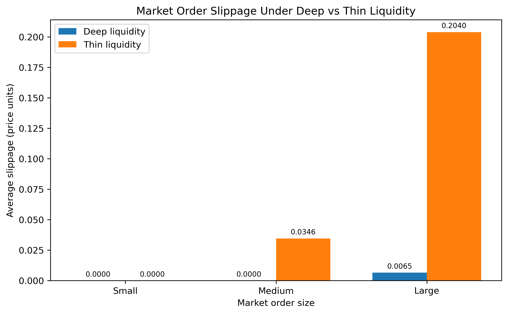

# Electronic Exchange Simulator

A Python-based electronic exchange simulator implementing a limit order book with price-time priority, market and limit orders, partial fills, cancellations and automated testing.

The project also includes a controlled market-microstructure experiment examining how order-book depth affects market-order slippage.

## Features

- Limit and market orders
- Buy and sell order books
- Price-time priority matching
- Partial and full fills
- Order cancellation
- Multi-level market-order execution
- Best bid and best ask tracking
- Trade generation
- Automated testing with pytest
- Liquidity and slippage simulation
- Reproducible deep-vs-thin liquidity experiment

## Matching Logic

Orders are matched using **price-time priority**:

1. Orders at the best available price are executed first.
2. At the same price, the earliest order is executed first.

Example:

```text
SELL
£101    80

----------------

£100    50    Order 1
£100    40    Order 2
£99     70

BUY

```

If a sell order for 60 units arrives at £100:

```text
Order 1 fills 50
Order 2 fills 10
Order 2 retains 30 units
```

This preserves time priority within the £100 price level.

## Market Orders

Market orders consume liquidity beginning at the best available price and continue through subsequent price levels until the order is filled or available liquidity is exhausted.

Example:

```text
ASKS

100.05    75
100.20    75
100.35    75
100.50    75
```

A market buy for 200 units executes:

```text
75 @ 100.05
75 @ 100.20
50 @ 100.35
```

The volume-weighted execution price is therefore worse than the original best ask, creating slippage.

## Project Structure

```text
Electronic-exchange-simulator/
│
├── src/
│   ├── order.py
│   ├── trade.py
│   ├── order_book.py
│   ├── matching_engine.py
│   └── simulation.py
│
├── tests/
│   ├── test_order.py
│   ├── test_order_book.py
│   └── test_matching_engine.py
│
├── analysis/
│   ├── liquidity_results.csv
│   ├── plot_results.py
│   └── slippage_by_liquidity.png
│
├── pytest.ini
├── requirements.txt
└── README.md
```

## Automated Tests

The test suite covers:

- Order creation
- Best bid and best ask
- Price priority
- Time priority
- Partial fills
- Market buy orders
- Market sell orders
- Multi-level execution
- Unfilled market-order behaviour
- Order cancellation
- Removal of empty price levels
- Invalid cancellation requests

Run the test suite with:

```bash
python -m pytest -v
```

## Liquidity Experiment

A controlled experiment was used to examine how market-order size and order-book liquidity affect execution quality.

Both liquidity regimes begin with the same:

```text
Best bid: 99.95
Best ask: 100.05
```

The difference is the depth and spacing of the book.

### Deep Liquidity

```text
Quantity per price level: 250
Price-level spacing:      0.05
```

### Thin Liquidity

```text
Quantity per price level: 75
Price-level spacing:      0.15
```

The same random sequence of order sizes and buy/sell directions is used for both regimes using a fixed random seed.

A total of **200,000 market orders** were simulated:

- 100,000 under deep liquidity
- 100,000 under thin liquidity

## Results

| Order Size | Average Quantity | Deep Slippage | Thin Slippage |
|---|---:|---:|---:|
| Small | 29.95 | ~0.0000 | ~0.0000 |
| Medium | 100.25 | ~0.0000 | 0.0346 |
| Large | 275.34 | 0.0065 | 0.2040 |

Large market orders experienced substantially greater slippage in the thinner order book.

For the large-order group, average slippage was approximately **31× higher under thin liquidity** than under deep liquidity.

Both regimes achieved a 100% fill rate in this experiment, meaning the observed difference relates to **execution price rather than execution probability**.

## Results Visualisation



## Interpretation

The simulation demonstrates the relationship between market depth and execution cost.

In the deep order book, most small and medium market orders can execute entirely at the best available price because 250 units are available at each price level.

Large orders occasionally consume additional price levels, producing some slippage.

In the thin order book, only 75 units are available at each level and prices are spaced further apart. Larger market orders therefore consume several price levels, increasing their volume-weighted average execution price and generating significantly greater slippage.

## Running the Project

Clone the repository:

```bash
git clone https://github.com/walizadaramez74-boop/Electronic-exchange-simulator.git
cd Electronic-exchange-simulator
```

Install dependencies:

```bash
pip install -r requirements.txt
```

Run the tests:

```bash
python -m pytest -v
```

Run the liquidity experiment:

```bash
python src/simulation.py
```

Generate the results chart:

```bash
python analysis/plot_results.py
```

## Technologies

- Python
- pytest
- matplotlib
- Git / GitHub

## Future Improvements

- Faster order cancellation using an order-ID index
- More efficient price-level data structures
- Performance and latency benchmarking
- C++ matching-engine implementation
- Additional order types
- More realistic stochastic order-flow models
- Historical market-data calibration
